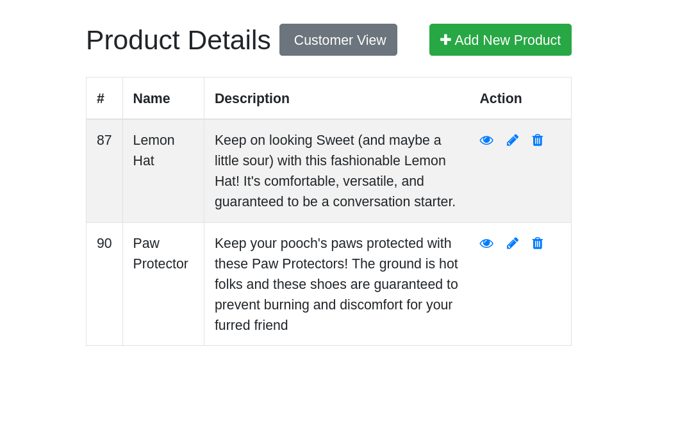
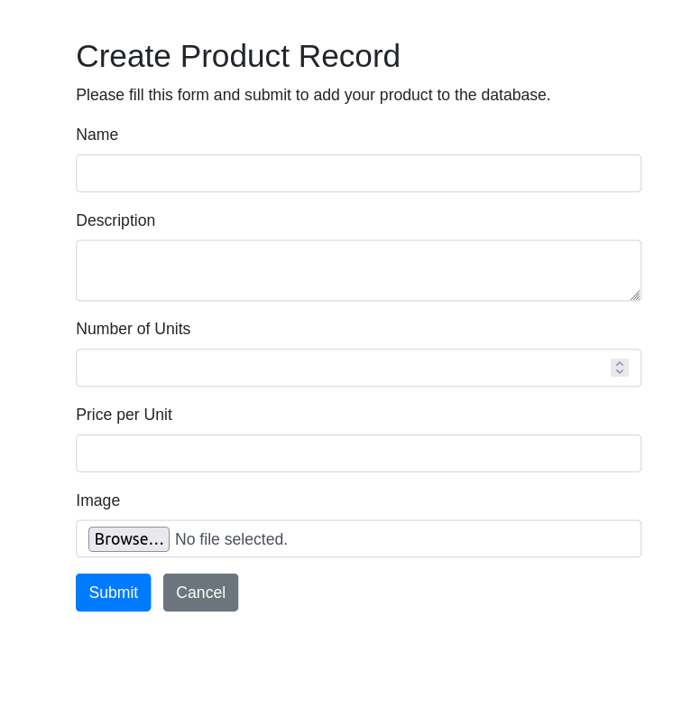
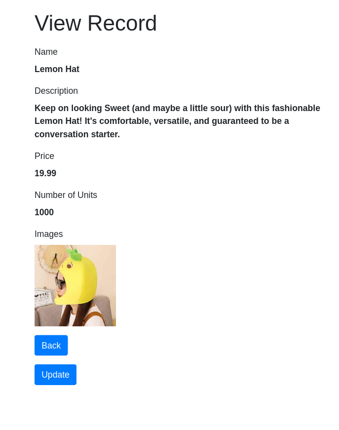
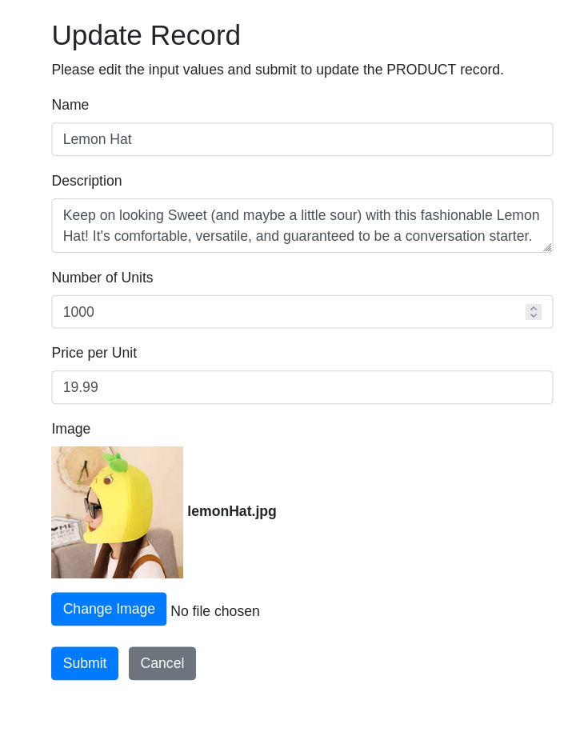
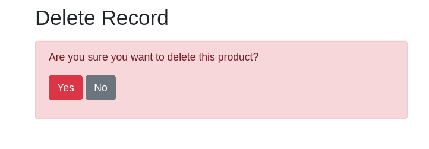
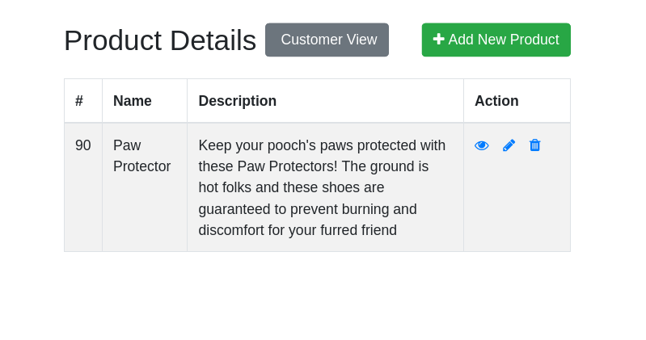
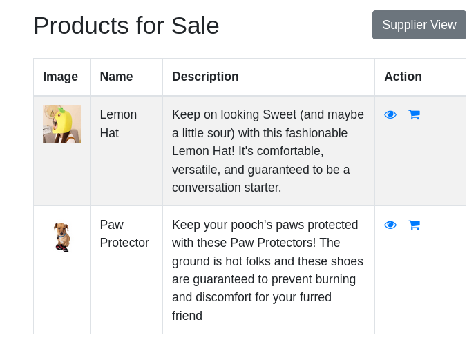
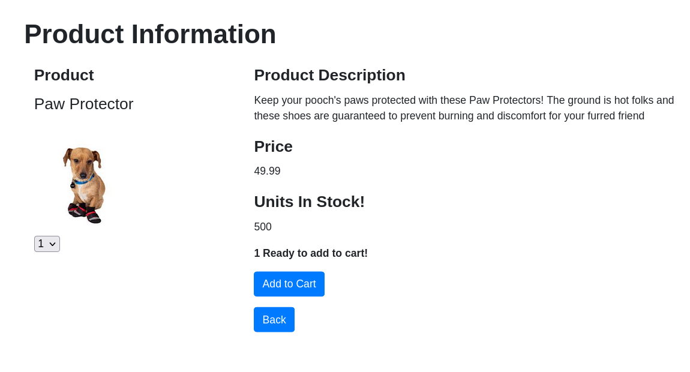

# Supplier Dashboard
This project is designed to demonstrate proficiency with the LAMP stack. It allowes suppliers/sellers to create items and have them entered into a database. There is also an option for a consumer view and the consumer functionality is built such that it could be expanded in the future

## Software Used 
Software used - PHP, SQL (MySQL), CSS, HTML, GIT, Apache2, bash, JS
Resources - https://www.tutorialrepublic.com/php-tutorial/php-mysql-connect.php
            Used this as a guide for connecting mysql database as well as a PHP guide for crud applications

## File Structure
The code is organized into a standard MCV format. Models handle database operations, Controllers handle data validation and all the business logic to ensure the models are getting the correct information, and the Views are the HTML and CSS files for each landing page.

For the sake of visual clarity, all of the CRUD operations have been seperated out into their own files. In practice they would be in one file and broken down into seperate functions. Currently there is no seperation for files serving the supplier and the customer as I did not want to have a lot of file trees, however it would be a trivial matter to create a new set of MVC directories in a "customer" directory.

## File Explaination
**config.php** handles the connection to the MySQL database.
**index.php** is the main landing page for the project. As this project is a dashboard for suppliers, **index.php** takes the user directly to the page where all product information is displayed.
**suppliers.sql** is the phpmyadmin dump of the database structure and set up.
**img** is the directory of screenshots so that they will appear in the README.md

## Orienting Yourself in the Code
Everything begins in **index.php**. From there the user has the option to perform any CRUD operation. Their selection will send them to the View for that specific operation. The Controller for that operation will immediatly be triggered as well.
For example in **Views/read_product.php**:
```php
    include "../config.php";
    require "../Controllers/read_product.php";
```
The controller will then go about sending or reviecing data from the database by calling functions from the pertanant Model file based on the actions of the user. When the operation is complete the user will be redirected (or prompted to go) to the main landing page, **index.php**.

Since all CRUD operations follow the same schema, this process is identical across all parts of the codebase.

## Image Uploading and Updating
Images are stored and accessed in the **uploads** directory while the file name is stored in the images table. This is because it would be grossly inefficient to save images in the database. Image uploads are handled by the **uploads.php** file found in the **Models** directory, and image updating is handled by **update_upload.php** which is also found in that directory. 

They are seperated because of how updates are performed. The SQL "UPDATE" command is used when a supplier wishes to change the products image. This is done in place of combining "DELETE" and "CREATE". If a refactor were to happen for this portion of the code it would be changed to the later method which would allow for more code to be shared across use cases.

## Database Information
MySQL is the database being used in conjunction with phpmyadmin simply for rapid access and efficiency. There are currently two tables in the database: One for products, and one for images. 
**Products**
```sql 
-- The info being tracked in the products database
CREATE TABLE IF NOT EXISTS `products` (
  `id` int NOT NULL AUTO_INCREMENT,
  `name` varchar(100) NOT NULL,
  `description` text NOT NULL,
  `number_of_units` int NOT NULL,
  `price` varchar(10) NOT NULL,
  PRIMARY KEY (`id`)
) ENGINE=InnoDB DEFAULT CHARSET=utf8mb4 COLLATE=utf8mb4_0900_ai_ci;
```

**Images**
```sql
-- Info being tracked for images
CREATE TABLE IF NOT EXISTS `images` (
  `id` int NOT NULL AUTO_INCREMENT,
  `file_name` varchar(255) NOT NULL,
  `product_id` int NOT NULL,
  PRIMARY KEY (`id`),
  KEY `images_ibfk_1` (`product_id`)
) ENGINE=InnoDB DEFAULT CHARSET=utf8mb4 COLLATE=utf8mb4_0900_ai_ci;

ALTER TABLE `images`
  ADD CONSTRAINT `images_ibfk_1` FOREIGN KEY (`product_id`) REFERENCES `products` (`id`) ON DELETE CASCADE ON UPDATE RESTRICT;
```

The images table is set up such that it can be a Many:1 relationship meaning that, in future PRs, suppliers could upload multiple photos for a carousel. This is an example of coding with the future in mind. It's also important to note that the images will be deleted when/if the product is deleted. Also implementable would be a soft delete. For that an extra field would be included in the tables indicating whether or not the image or product or both have been deleted. Not implemented here as to show all CRUD operations.

## Visuals 
**Supplier Dashboard**

The icons in the "Action" Column link to the "Read" "Update" and "Delete" views respectively.
They are part of the bootstrap package.

**Create a Product**



**Supplier View of a Product**



**Update a Product**


The image will only be changed if the user clicks the "Change Image" button and actually selects a new image.


**Delete a Product**



Shows Supplier Dashboard after a successful delete operation.


**Customer Dashboard**


Cart Icons are for features which will be implemented in the future.


**Customer View of a Product**


The dropdown menu allows for users to select a number of products that they would like to purchase. Then Java Script will update the DOM to reflect the users choice.


## Roadmap
Getting the cart feature up and running is next on the agenda. It will involve a few new tables in the database some handling session data and others handling processed data. 
Tables that will be needed:

**STATIC**
"order_items" - pivot table containing an order ID and product ID
"order_details" - table combining customer information and info from "order_items"

**SESSION**
"shopping_session" - table containing customer ID, total price. 
"item_in_cart" - pivot table linking products currently in the cart and the session (user)

    